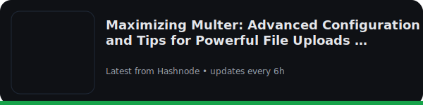
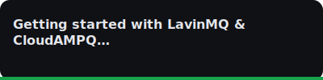

<table style="width:100%; background-color:#0d0d0d; color:white; border-radius:10px; padding:20px;">
<tr>
  <!-- Left Column -->
  <td style="width:40%; vertical-align:top;">
    <h1>Aditya Verma</h1>
    
Backend developer | Cloud enthusiast | Tech blogger

  <h3>About Me</h3>
    

      I’m a 3rd-year Computer Science student at Parul University, passionate about 
      <b>backend systems, cloud infrastructure, and scalable applications</b>.  
      I enjoy solving problems, building efficient APIs, and writing technical blogs 
      to simplify complex concepts.
    

  </td>

  <!-- Right Column -->
  <td style="width:60%; vertical-align:top;">
    <h3 align="left"> Technologies</h3>

  
  
  
  
  
  
  

    <h3>Blogs</h3>
    

      
    

    

      
    

    

      
    

    <table style="width:100%; margin-top:10px;">
      <tr>
        <td align="center">
          
          
        </td>
      </tr>
    </table>
  </td>
</tr>
</table>
